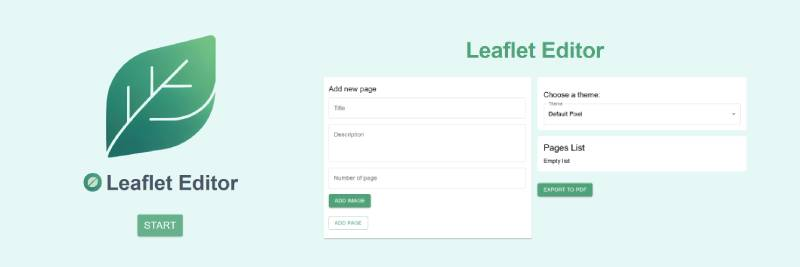

# 📰 Leaflet Editor – React + TypeScript + Tailwind CSS + Material UI + Zustand

Responsywny edytor do tworzenia wielostronicowych **gazetek** z możliwością edycji, podglądu, eksportu do PDF i wyboru stylów. Projekt stworzony w celu przetestowania użycia **Material UI** oraz **Zustand** w praktycznej aplikacji frontendowej.

---

## ✨ Technologie

- ⚛️ **React** – komponentowa architektura
- 🔷 **TypeScript** – statyczne typowanie i lepsze wsparcie dla IDE
- 💨 **Tailwind CSS** – szybkie i elastyczne stylowanie
- 🎨 **Material UI** – gotowe komponenty interfejsu
- ⚡ **Zustand** – prosty i wydajny state management
- 🧩 **@hello-pangea/dnd** – obsługa drag & drop (fork react-beautiful-dnd)
- 🎞️ **framer-motion** – animacje i efekty przejść
- 👀 **react-intersection-observer** – animacje przy przewijaniu
- 🖼️ **html2canvas** – renderowanie komponentów do obrazu
- 📄 **jsPDF** – generowanie plików PDF
- 💅 **Sass (SCSS)** – stylowanie z możliwością zagnieżdżeń i zmiennych
- 🛠️ **Vite** – nowoczesne i szybkie środowisko deweloperskie

---

## 🌐 Wersja Live

> 🔗 **[Zobacz na żywo]()**

---

## 🔧 Instalacja i uruchomienie lokalne

Aby uruchomić projekt lokalnie:

```bash
git clone https://github.com/twoj-login/leaflet-editor.git
cd leaflet-editor
npm install
npm run dev
```

---

## 📄 Funkcjonalności

- ✍️ Tworzenie stron z:
  - Numerem strony
  - Tytułem
  - Opisem
  - Zdjęciem (upload i podgląd)
- 🎨 Wybór stylu gazetki (motywu):
  - Default Pixel
  - Old School
  - Hell (Red)
- 🧩 Drag & Drop – łatwe przestawianie stron
- 🔁 Edycja każdej utworzonej strony
- 🗑️ Usuwanie stron
- 📤 Eksport gotowej gazetki do PDF (z zachowaniem stylów)
- 👀 Podgląd na żywo każdej strony
- ⚡ Animacje sekcji i elementów (framer-motion)
- 🖼️ Automatyczne generowanie podglądu strony do PDF (html2canvas + jsPDF)

---

## 📁 Struktura projektu

```
leaflet-editor/
├── public/
├── src/
│   ├── assets/           # Obrazy i zasoby
│   ├── components/       # Komponenty UI
│   │   ├── ExportToPDF/
│   │   ├── ImagePreview.tsx
│   │   ├── PageEditor.tsx
│   │   ├── PagePreview.tsx
│   │   ├── PagesList.tsx
│   │   └── ThemeSelector.tsx
│   ├── hooks/            # Custom hooki
│   ├── pages/            # Widoki/strony
│   ├── styles/           # Style globalne i theme
│   ├── utils/            # Funkcje pomocnicze
│   ├── store.ts          # Zustand - zarządzanie stanem
│   ├── types.ts          # Typy globalne
│   ├── App.tsx           # Layout aplikacji
│   ├── main.tsx          # Entry point
│   ├── App.css / index.css
│   └── vite-env.d.ts
├── package.json
├── tailwind.config.js
├── eslint.config.js
└── README.md
```

---

## 🧪 Wnioski z wykorzystanych bibliotek i narzędzi

- **Material UI** – bardzo szybkie prototypowanie, ale wymaga dostosowania do Tailwinda (np. sx vs className). Dobrze integruje się z TypeScript.
- **Zustand** – prosty, lekki i bardzo czytelny state management. Idealny do małych i średnich aplikacji, nie wymaga providerów.
- **@hello-pangea/dnd** – obsługa drag & drop jest intuicyjna, ale wymaga pilnowania kluczy i indeksów. Działa stabilnie.
- **framer-motion** – pozwala łatwo dodać animacje wejścia/wyjścia, bardzo płynne efekty.
- **react-intersection-observer** – świetny do animacji sekcji przy przewijaniu, prosty w użyciu.
- **html2canvas + jsPDF** – umożliwia eksport do PDF z zachowaniem stylów, ale wymaga czasem poprawek przy niestandardowych stylach (np. clip-path, niestandardowe fonty).
- **Tailwind CSS** – bardzo szybkie stylowanie, ale czasem koliduje z Material UI (warto wybrać jeden główny system stylowania).
- **Vite** – błyskawiczny start i hot reload, polecam do każdego nowego projektu.

---

## 📝 Co jeszcze można dodać?

- Lepszy podgląd gazetki (np. tryb pełnoekranowy)
- Możliwość zmiany kolejności stron w PDF
- Więcej motywów/stylów
- Obsługa wielu gazet (projektów)
- Zapis do localStorage lub chmury
- Własne fonty i kolory dla użytkownika
- Responsywność pod mobile (obecnie głównie desktop)

---

## 📸 Przykładowe użycie

- Tworzenie gazetki reklamowej
- Wewnętrzne biuletyny firmowe
- Personalizowane broszury PDF

---

## 📜 Licencja

Projekt dostępny na licencji MIT.
